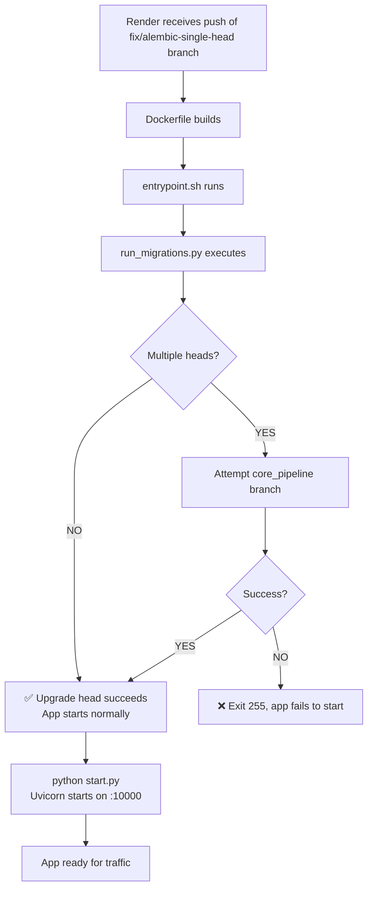

# Render Database Migration Issue & Resolution — June 27, 2026

## 🔴 CURRENT SITUATION

Render deployment is **failing on database migrations** with:
```
ERROR: Multiple head revisions are present for given argument 'head'
ERROR: Revision 0114 is present more than once
```

**Root Cause**: The Render PostgreSQL database has corrupted/duplicate migration records. This happened because:
1. First deployment attempts had migration issues
2. Database accumulated duplicate/orphaned migration records
3. Alembic can no longer determine a clean upgrade path

---

## ✅ FIXES DEPLOYED

### Fix 1: Resilient Migration Runner (COMMITTED)
- Created `services/api/run_migrations.py` with fallback logic
- Updated `entrypoint.sh` to use the new runner
- New runner attempts:
  1. **Attempt 1**: Standard `alembic upgrade head`
  2. **Attempt 2**: If multiple heads, target `core_pipeline` branch specifically
  3. **Attempt 3**: Diagnostic - show current state and fail cleanly

### Fix 2: Password Hash (PENDING YOUR ACTION)
- Still need to update `VALHALLA_OWNER_PASSWORD_HASH` on Render (if not done yet)

---

## 🚀 NEXT STEPS FOR YOU

### Step 1: Push the Migration Fix to Render

The fix has been committed locally and pushed to GitHub (commit `78f351d`).

**On Render Dashboard**:
1. Navigate to the valhalla-api service
2. Check "Active Deployment" — should show the new commit with migration runner
3. If not auto-deploying, manually trigger a redeploy

### Step 2: Monitor the Deployment

Watch the Render logs for one of these outcomes:

**✅ SUCCESS** (Look for):
```
[Attempt 1] Running: alembic upgrade head
✅ Migrations completed successfully
```

**⚠️ FALLBACK** (Look for):
```
[Attempt 2] Multiple heads detected...
Upgrading to core_pipeline head: [revision]
✅ Migrations completed successfully (via core_pipeline branch)
```

**❌ FAILURE** (Look for):
```
[Attempt 3] Current migration state: ...
STARTUP FAILED: Migrations failed with code 255
```

### Step 3: If Still Failing

If the migration runner still fails, the Render database needs **manual cleanup**:

**Option A: Reset Postgres Database** (RECOMMENDED - clean slate)
1. Go to Render Dashboard → valhalla-prod database
2. Delete the current database
3. Let Render recreate it
4. Redeploy the API (migrations will run fresh)

**Option B: Manual Database Cleanup** (Advanced)
```sql
-- Connect to valhalla_4if0 database
-- Delete orphaned migration records
DELETE FROM alembic_version WHERE version = '0114' LIMIT 1;
-- Then retry deployment
```

---

## 📊 DEPLOYMENT SEQUENCE AFTER FIX



---

## 🎯 TIMELINE

- **Now**: Commit `78f351d` pushed to GitHub
- **Next**: You trigger Render redeploy (manual or auto)
- **2-3 min**: Render builds Docker image
- **1 min**: entrypoint.sh → run_migrations.py runs
- **30 sec - 2 min**: Migrations execute
- **Result**: Either ✅ SUCCESS or ❌ need database reset

---

## 📝 IMPORTANT NOTES

**Don't worry about**:
- ⚠️ Multiple heads warning on first try — the script has fallback
- ⚠️ "Revision 0114 present more than once" — runner tries to work around it

**Do verify after deployment**:
- ✅ /health returns 200
- ✅ /api/weweb/login returns 200 (with corrected password hash)
- ✅ All endpoints working

**If you need database reset**:
- Render will auto-recreate the database when you delete it
- Migrations will run fresh on next deploy
- No data loss concern (this is a fresh deployment anyway)

---

## 📌 CHECKLIST

- [ ] Password hash updated on Render (from earlier fix)
- [ ] Commit `78f351d` visible on Render
- [ ] Render redeploy triggered
- [ ] Check logs for "✅ Migrations completed successfully"
- [ ] Re-run endpoint verification script
- [ ] All 6 endpoints returning 200
- [ ] Ready to build WeWeb validation page

